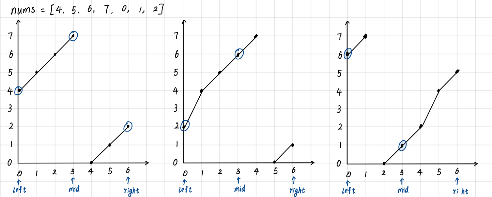

# 33. Search in Rotated Sorted Array
经过颠倒后，数组的顺序不再是原来递增的样子，可能出现下面的情况：


解题思路还是往二分搜索想，不过这时数组只是部分有序，从图中可以看出比较 `nums[left]` 和 `nums[mid]` 的值，可以知道是 `[left, mid]`还是 `[mid, right]`有序。

1. 先判断 `nums[mid]` 和 `target` 是否相等，相等直接返回 `mid`，不相等继续。
2. 判断数组哪一部分有序，如果 `nums[left] <= nums[mid]`，说明 `[left, mid]`是有序的，如果 `target` 在此区间`[left, mid)`（排除`target == nums[mid]`），就缩小下次二分搜索的范围到 `[left, mid]`，由于在第1步中已经排除了 `target == nums[mid]`的情况，因此准确的缩小范围是 `[left, mid - 1]`。否则缩小二分范围是`[mid + 1, right]`。
3. 如果 `nums[left] > nums[mid]`，说明 `[mid, right]`有序。
   * 如果 `target` 在区间`(mid, right]` => 二分范围 `[mid + 1, right]`
   * 否则 => 二分范围 `[left, mid - 1]`

```rust
impl Solution {
    pub fn search(nums: Vec<i32>, target: i32) -> i32 {
        if nums.len() == 1 {
            if nums[0] == target {
                return 0;
            } else {
                return -1;
            }
        }
        
        let (mut left, mut right) = (0 as usize, ( nums.len() - 1 ) as usize);
        while (left <= right) {
            let mid = left + (right - left) / 2;
            if (nums[mid] == target) {
                return mid as i32;
            }
            
            if (nums[left] <= nums[mid]) { // [left,...,mid] 是有序的
                if (nums[left] <= target && target < nums[mid]) {  // target 在 [left, mid - 1] 之间
                    right = mid - 1;
                } else { // target 在 [mid + 1, right] 之间
                    left = mid + 1;
                }
            } else { // [mid,...,right] 是有序的
                if (target > nums[mid] && target <= nums[right]) {  // target 在 [mid + 1, right] 之间
                    left = mid + 1;
                } else { // target 在 [left, mid - 1] 之间
                    right = mid - 1;
                }
            }
        }
        -1
    }
}
```

时间复杂度：O(log n)，二分搜索的复杂度

空间复杂度：O(1)
